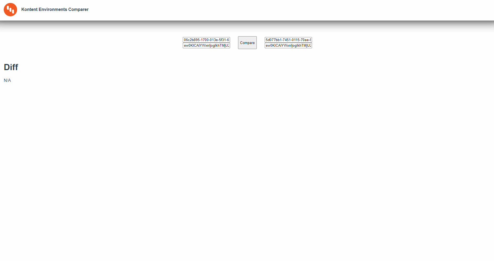

# kontent-environment-comparer



## Project setup

Install dependencies

  ```sh
  yarn install
  ```

Compiles and hot-reloads for development

  ```sh
  yarn serve
  ```

Compiles and minifies for production

  ```sh
  yarn build
  ```

Lints and fixes files

  ```sh
  yarn lint
  ```

### Customize configuration

See [Configuration Reference](https://cli.vuejs.org/config/).
